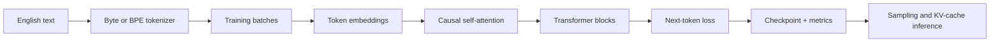
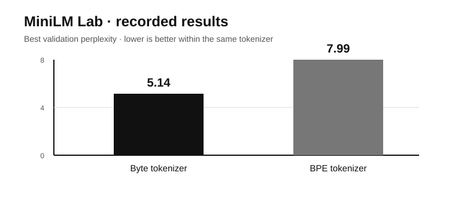

# MiniLM Lab

### Build a small language model. Measure every trade-off. Understand the machinery.

[](https://github.com/AnvitDevadiga/MiniLM-Lab/actions/workflows/ci.yml)
[](https://www.python.org/)
[](https://pytorch.org/)
[](LICENSE)

**Author:** Anvit Devadiga

MiniLM Lab is a from-scratch, local-first decoder-only Transformer for learning how language models work—and proving what changes actually improve them. It trains on Apple Silicon, records reproducible metrics, and turns implementation details into controlled experiments.

## Why this project

Most small language-model projects stop at “I trained a tiny GPT.” MiniLM Lab goes further: it compares tokenization, positional encoding, training strategy, fine-tuning, quantization, and inference systems with measurable evidence.

## What is implemented

| Area | Implemented |
|---|---|
| Model | Decoder Transformer, causal attention, LayerNorm, tied embeddings |
| Tokenization | Byte-level tokenizer and learned BPE tokenizer |
| Positions | Learned embeddings and RoPE ablation path |
| Training | Validation split, perplexity, gradient accumulation, checkpoints |
| Generation | Temperature, top-k, top-p sampling, KV-cache decoding |
| Efficiency | MPS support, generation benchmarks, dynamic-int8 utility |
| Fine-tuning | LoRA building block |
| Quality | Tests, linting, CI, bits-per-byte evaluation, experiment logs |

## Architecture



## Recorded baseline

Experiments use the Tiny Shakespeare corpus on Apple Silicon MPS.

| Experiment | Result |
|---|---:|
| Byte tokenizer best validation perplexity | **5.14** |
| BPE tokenizer best validation perplexity | **7.99** |
| BPE full-split perplexity | **10.94** |
| BPE bits per byte | **2.4814** |
| Recorded generation throughput | **523 tokens/sec** |

Perplexity across tokenizers is not directly comparable because the token units differ. The project therefore also records bits per byte and qualitative generation results. See the [research report](docs/research_report.md) for methodology and limitations.



## Quickstart

```bash
python3.12 -m venv .venv
source .venv/bin/activate
python -m pip install -e '.[dev]'
make check
```

Run a named experiment without overwriting earlier results:

```bash
python scripts/run_experiment.py byte-10000 data/tinyshakespeare.txt \
  --steps 10000 --eval-interval 250
```

Generate text:

```bash
python scripts/generate.py "To be or not to be" \
  --checkpoint artifacts/runs/byte-10000/best_checkpoint.pt \
  --tokens 200 --top-k 40 --top-p 0.95
```

Benchmark cached versus uncached inference:

```bash
python scripts/benchmark_kv_cache.py \
  --checkpoint artifacts/runs/byte-10000/best_checkpoint.pt --tokens 200
```

## Repository map

- `src/minilm_lab/` — model, tokenizers, generation, KV cache, LoRA
- `scripts/` — training, evaluation, benchmarking, and experiment commands
- `tests/` — correctness and smoke tests
- `docs/research_report.md` — methodology, results, and limitations
- `docs/experiment_log.md` — experiment template and comparison plan

## Status

The core system and first research baselines are complete. The next research runs are matched RoPE comparisons, KV-cache latency measurements, LoRA fine-tuning, and int8 quality/size trade-offs.

## License

MIT — see [LICENSE](LICENSE).
