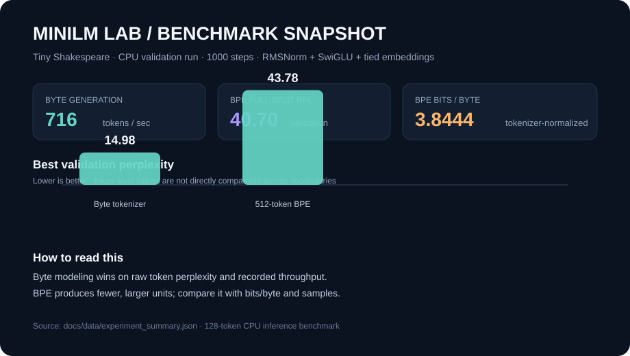

# MiniLM Lab

**A measurable decoder-only Transformer built from first principles.**

Research code for understanding the systems behind small language models.

[](https://github.com/AnvitDevadiga/MiniLM-Lab/actions/workflows/ci.yml)
[](https://www.python.org/)
[](https://pytorch.org/)
[](LICENSE)

**Maintainer:** Anvit Devadiga · **Status:** reproducible research baseline



MiniLM Lab is a local-first ML systems laboratory. It implements the path from bytes to next-token generation, then measures the trade-offs instead of hiding them behind framework abstractions. The repository is intentionally small, documented, and reproducible: every result has a protocol, a data source, and an explicit limitation.


## What is implemented

```text
text → byte/BPE tokenizer → embeddings → causal attention → RoPE/RMSNorm
                            → SwiGLU MLP → tied LM head → loss/generation
```

| Area | Implementation | Evidence |
| --- | --- | --- |
| Tokenization | byte-level and learned BPE | round-trip tests, tokenizer trainer |
| Transformer | causal MHA, SDPA, learned positions, RoPE, RMSNorm, SwiGLU | shape, loss, RoPE tests |
| Training | AdamW, accumulation, validation, best checkpoints | `train_tiny.py` |
| Inference | temperature, top-k, top-p, incremental KV cache | cache equivalence tests |
| Adaptation | LoRA linear adapter | trainable-parameter test |
| Compression | CPU dynamic INT8 experiment | `quantize.py` |
| Measurement | throughput, cache speedup, perplexity, bits/byte | benchmark scripts and reports |

## Quick start

```bash
python3.12 -m venv .venv
source .venv/bin/activate
python -m pip install -e '.[dev]'
make check
```

Train and evaluate a small run:

```bash
python scripts/train_tiny.py data/tinyshakespeare.txt --steps 1000 --eval-interval 100
python scripts/evaluate.py data/tinyshakespeare.txt --checkpoint artifacts/best_checkpoint.pt
python scripts/generate.py 'To be or not to be' --checkpoint artifacts/best_checkpoint.pt --tokens 200
```

Train a BPE vocabulary and run the same experiment:

```bash
python scripts/train_tokenizer.py data/tinyshakespeare.txt --vocab-size 512 --output artifacts/bpe.json
python scripts/train_tiny.py data/tinyshakespeare.txt --tokenizer artifacts/bpe.json --steps 1000
```

Benchmark the systems question directly:

```bash
python scripts/benchmark_kv_cache.py --checkpoint artifacts/best_checkpoint.pt --tokens 100 --output artifacts/kv_cache.json
python scripts/benchmark_generation.py --checkpoint artifacts/best_checkpoint.pt --tokens 100 --output artifacts/generation.json
```

## Project map

```text
src/minilm_lab/   model, tokenizers, data, generation, KV cache, LoRA
scripts/          training, evaluation, generation, profiling, quantization
tests/            correctness and regression tests
docs/             audit, protocol, research report, experiment log
configs/          small reproducible configurations
```

## Results and interpretation

The checked-in dashboard contains the current 1,000-step baseline for the upgraded RMSNorm + SwiGLU architecture. The run was validated on CPU; rerun on Apple Silicon MPS for hardware-specific throughput. Token-level perplexity cannot be compared directly across different vocabularies; use bits per byte and matched-budget qualitative samples as complementary evidence.

The benchmark data is tracked at [docs/data/experiment_summary.json](docs/data/experiment_summary.json), and the figures are regenerated with:

```bash
python scripts/build_report_assets.py
```

- [Implementation audit](docs/implementation_audit.md)
- [Research report](docs/research_report.md)
- [Experiment protocol](docs/experiment_protocol.md)
- [Experiment log](docs/experiment_log.md)
- [Roadmap](docs/roadmap.md)
- [Contributing](CONTRIBUTING.md)
- [Security policy](SECURITY.md)
- [Citation](CITATION.cff)

## Scope

This is an educational, reproducible systems project—not a general-purpose assistant. Tiny Shakespeare is narrow and small. Results describe this corpus, model size, software stack, and hardware; they are not claims about broad language understanding.

## License

MIT. Built by Anvit Devadiga.
