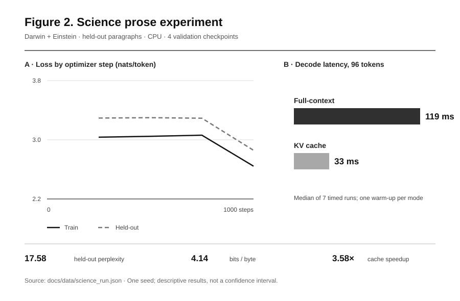

# MiniLM Lab

**A small language-model systems laboratory. Built and maintained by Anvit Devadiga.**

[](https://github.com/AnvitDevadiga/MiniLM-Lab/actions/workflows/ci.yml) [](https://www.python.org/) [](LICENSE)

MiniLM Lab implements a decoder-only Transformer and measures its training and inference behavior on a laptop-sized budget. The current study trains on two public-domain science books: Charles Darwin's *On the Origin of Species* and Albert Einstein's *Relativity*. Each book contributes held-out paragraphs. The full data provenance and hashes are recorded in [the corpus manifest](data/science/manifest.json).


## Measured result



| Measurement | Result | Conditions |
| --- | ---: | --- |
| Held-out perplexity | 17.58 | 112,111 byte targets; both books represented |
| Held-out bits per byte | 4.14 | Exact scored-byte denominator |
| KV-cache speedup | 3.58× | 96 tokens, 21-token prompt, CPU median of seven repeats |
| Weight-only INT8 stored size | 4.56 MB vs 9.84 MB | MLP linear weights only; attention and tied head remain FP32 |
| INT8 loss change | +0.00015 nats/token | Same held-out text |

The INT8 reference dequantizes weights on each forward pass and was **slower** than FP32 in this run. It demonstrates size and quality trade-offs, not accelerated deployment. These are one-seed, CPU results; no claim of general language ability or statistical significance follows from them. The [research report](docs/research_report.md) explains the method and limitations.

## Reproduce on a MacBook Air

```bash
python3.12 -m venv .venv
source .venv/bin/activate
python -m pip install -e '.[dev]'
make check
python scripts/prepare_science_corpus.py
python scripts/train_tiny.py data/science/train.txt \
  --validation-text data/science/validation.txt \
  --steps 1000 --eval-interval 250 --gradient-accumulation-steps 4 \
  --output-dir artifacts/runs/science-v2
python scripts/evaluate.py data/science/train.txt \
  --validation-text data/science/validation.txt \
  --checkpoint artifacts/runs/science-v2/best_checkpoint.pt
```

Training chooses Apple MPS when available and otherwise runs on CPU. The published run used CPU because MPS was unavailable in its execution environment. Use `--device cpu` to match that hardware path. The corpus preparation script downloads the two source texts and records SHA-256 hashes. Source files can change upstream, so check the hashes before comparing a new run to the published one.

## System

| Component | Implementation |
| --- | --- |
| Tokenization | UTF-8 byte tokenizer; educational BPE alternative |
| Decoder | causal multi-head attention, learned positions or RoPE, RMSNorm, SwiGLU, tied token/output embeddings |
| Training | AdamW, true optimizer-step accumulation, deterministic full-split checkpoint selection, resume with optimizer and RNG state |
| Evaluation | every held-out next token scored once; perplexity and bits per byte |
| Generation | temperature, top-k, top-p; KV cache with sliding-window refresh |
| Experiments | repeated decode benchmark; portable MLP weight-only INT8 comparison; LoRA linear building block |

PyTorch provides tensor operations, automatic differentiation, multi-head attention and SDPA. The project exposes the model and systems decisions around those primitives. It is not a claim to reimplement an entire deep-learning framework.

## Read the evidence

- [Research report](docs/research_report.md)
- [Raw science run record](docs/data/science_run.json)
- [Experiment protocol](docs/experiment_protocol.md)
- [Implementation audit](docs/implementation_audit.md)
- [2026 positioning](docs/positioning_2026.md)
- [Roadmap](docs/roadmap.md)
- [Contributing](CONTRIBUTING.md)

## Scope

The corpus contains about 1 MB of training text. The model is a controlled educational system for studying language-model mechanics and inference trade-offs. Generated text should not be treated as reliable scientific information.

MIT licensed. © Anvit Devadiga.
