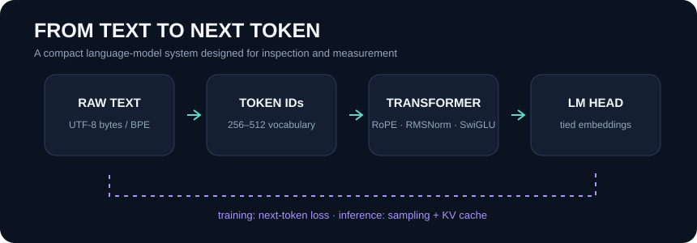
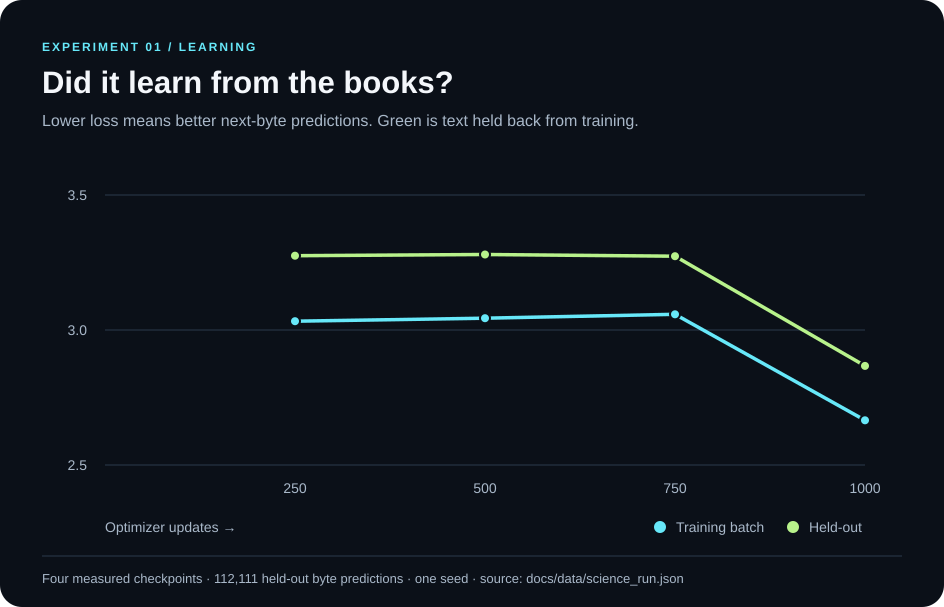
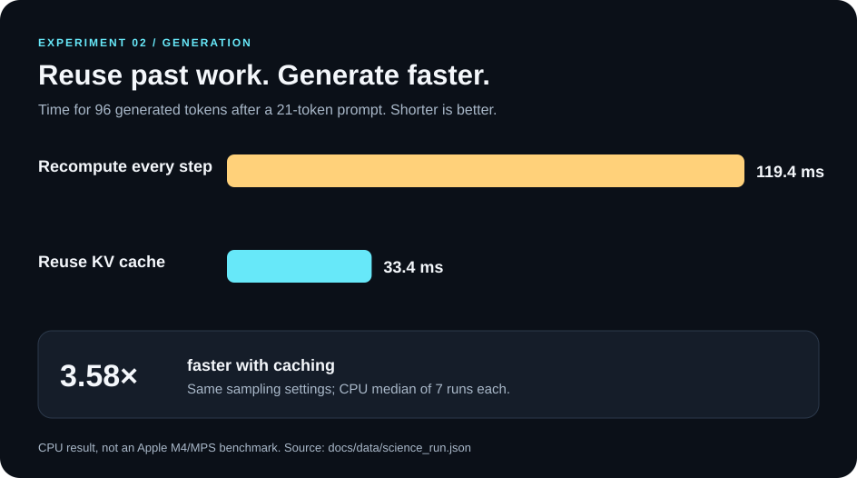
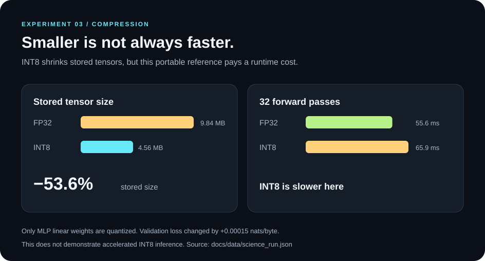

# MiniLM Lab

**Build a tiny language model. Measure what actually helps.**

Created and maintained by [Anvit Devadiga](https://github.com/AnvitDevadiga).

[](https://github.com/AnvitDevadiga/MiniLM-Lab/actions/workflows/ci.yml) [](https://www.python.org/) [](LICENSE)

MiniLM Lab is a small, inspectable language-model project. It follows the entire path from text to next-byte prediction, then tests whether engineering ideas—like reusing previous attention calculations or storing smaller weights—actually help. It is designed for a laptop budget, not to imitate a commercial chatbot.



### What did the experiment find?

The model trained on public-domain science writing by Darwin and Einstein. Paragraphs from **both** books were held out, so the numbers below are not training-set scores. [Sources and exact file hashes](data/science/manifest.json) · [Full experimental method](docs/experiment_protocol.md).



At the final checkpoint, held-out perplexity was **17.58** across **112,111 next-byte predictions**. Perplexity measures prediction uncertainty; lower is better, but it is not a score for how helpful or factual a chatbot is.



The KV cache avoids recomputing attention over the full prompt after every generated token. In this controlled CPU test, it cut generation time from **119.4 ms to 33.4 ms**.



Weight-only INT8 reduced stored model tensors by **53.6%**, but the reference implementation ran **slower** because it dequantizes weights during each forward pass. Smaller files do not automatically mean faster inference.

These are **one-seed CPU measurements**, not M4/MPS results or claims of general language ability. The training corpus is about **1 MB**. [Read the report, including limitations](docs/research_report.md) or inspect the [raw measured record](docs/data/science_run.json).

## Reproduce on a MacBook Air

You need Python 3.12 and the ability to install PyTorch. The commands below run the checks, prepare the pinned corpus, train the small model, and score the held-out text. Training time varies by device.

```bash
python3.12 -m venv .venv
source .venv/bin/activate
python -m pip install -e '.[dev]'
make check
python scripts/prepare_science_corpus.py
python scripts/train_tiny.py data/science/train.txt \
  --validation-text data/science/validation.txt \
  --steps 1000 --eval-interval 250 --gradient-accumulation-steps 4 \
  --output-dir artifacts/runs/science-v2
python scripts/evaluate.py data/science/train.txt \
  --validation-text data/science/validation.txt \
  --checkpoint artifacts/runs/science-v2/best_checkpoint.pt
```

Training chooses Apple MPS when available and otherwise runs on CPU. The published run used CPU because MPS was unavailable in its execution environment. Use `--device cpu` to match that hardware path. The corpus preparation script downloads the two source texts and records SHA-256 hashes. Source files can change upstream, so check the hashes before comparing a new run to the published one.

## System

| Component | Implementation |
| --- | --- |
| Tokenization | UTF-8 byte tokenizer; educational BPE alternative |
| Decoder | causal multi-head attention, learned positions or RoPE, RMSNorm, SwiGLU, tied token/output embeddings |
| Training | AdamW, true optimizer-step accumulation, deterministic full-split checkpoint selection, resume with optimizer and RNG state |
| Evaluation | every held-out next token scored once; perplexity and bits per byte |
| Generation | temperature, top-k, top-p; KV cache with sliding-window refresh |
| Experiments | repeated decode benchmark; portable MLP weight-only INT8 comparison; LoRA linear building block |

PyTorch provides tensor operations, automatic differentiation, multi-head attention and SDPA. The project exposes the model and systems decisions around those primitives. It is not a claim to reimplement an entire deep-learning framework.

## Read the evidence

- [Technical report (PDF)](output/pdf/MiniLM-Lab-Technical-Report.pdf)
- [Research report](docs/research_report.md)
- [Raw science run record](docs/data/science_run.json)
- [Experiment protocol](docs/experiment_protocol.md)
- [Implementation audit](docs/implementation_audit.md)
- [2026 positioning](docs/positioning_2026.md)
- [Roadmap](docs/roadmap.md)
- [Contributing](CONTRIBUTING.md)

The PDF is generated from the tracked results and SVG figures with
\`python -m pip install -e '.[report]'\` followed by
\`python scripts/build_technical_report.py\`.

## Scope

The corpus contains about 1 MB of training text. The model is a controlled educational system for studying language-model mechanics and inference trade-offs. Generated text should not be treated as reliable scientific information.

MIT licensed. © Anvit Devadiga.
